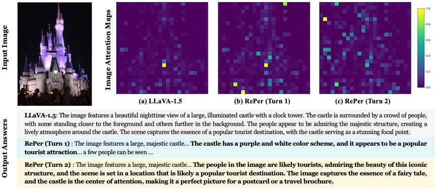
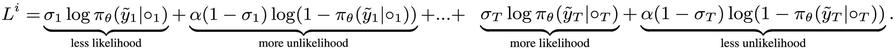
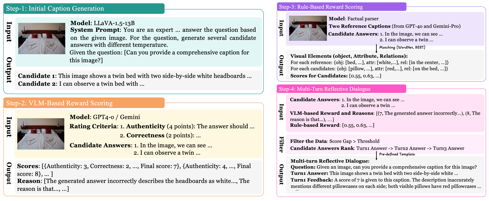
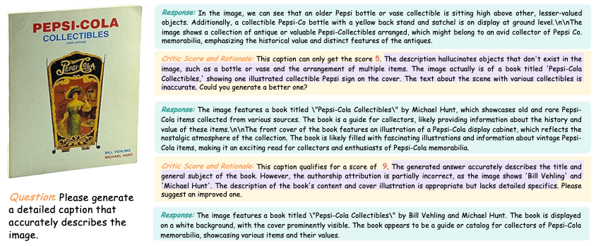
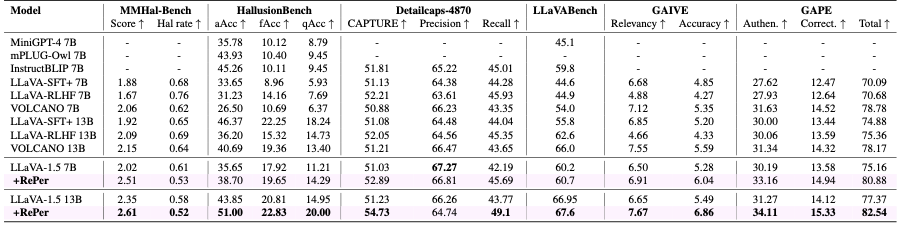
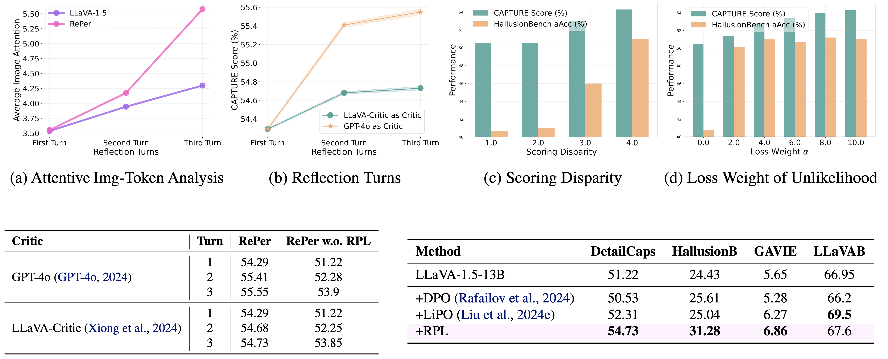

<div align="center">
  
  <h1 style="display: inline-block; vertical-align: middle; margin: 0;"> <strong><span style="color: #2b968d;">Per</span>ception in <span style="color: #2b968d;">Re</span>flection</strong></h1>
</div>

<!-- <p align="center">
  
</p> -->

<p align="center">
  <strong>RePer</strong> · <em>ICML 2025</em>
</p>

<p align="center">
  <a href="https://arxiv.org/abs/2504.07165"></a>
  <a href="https://weiyana.github.io/Perception-in-Reflection/"></a>
  
  
</p>


---

## 🧠 Abstract

> We present a perception in reflection paradigm designed to transcend the limitations of current large vision-language models (LVLMs), which are expected yet often fail to achieve perfect perception initially. Specifically, we propose Reflective Perception (RePer), a dual-model reflection mechanism that systematically alternates between policy and critic models, enables iterative refinement of visual perception. This framework is powered by Reflective Perceptual Learning (RPL), which reinforces intrinsic reflective capabilities through a methodically constructed visual reflection dataset and reflective unlikelihood training. Comprehensive experimental evaluation demonstrates RePer’s quantifiable improvements in image understanding, captioning precision, and hallucination reduction. Notably, RePer achieves strong alignment between model attention patterns and human visual focus, while RPL optimizes fine-grained and free-form preference alignment. These advancements establish perception in reflection as a robust paradigm for future multimodal agents, particularly in tasks requiring complex reasoning and multi-step manipulation.

---

## 📋 TODO

- [ ] 🤗 Release RePer checkpoints
- [ ] 🪚 Release Visual Reflection Dataset
- [ ] 🎩 Release code for reflective Unlikelihood Training
- [ ] 👀 Release GAPE evaluation for detailed, accurate image caption with no hallucinations

---

## 🙌 Highlights

- 👁️ RePer progressively shifts image attention toward human-aligned regions through iterative reflection, resulting in perceptual patterns that more closely mirror human focus.
- 🔁 Reflective Perceptual Learning serves as a free-form preference optimization that unifies various preference learning paradigms (DPO and LiPO), while enabling fine-grained supervision through explicit feedback signals.
- 🌇 RePer is an accurate and informative image captioner that significantly reduces hallucinations.

---
## ✨ Key Insights
**RePer Progressively Aligns Human Attention**
- The model accurately shifts its attention emphasis towards the correct image tokens, rather than over-focusing on a few insignificant ones.
<div align="center">
  
</div> 

**RPL is a Free-Form Preference Optimization**
- **Rewards increasing linearly from  rounds 1 to T.** The model mainly penalizes poor samples (more unlikelihood) in the initial rounds, while it gradually shifts to rewarding good samples (more likelihood) in later rounds. 
- This helps the model avoid overfitting to poor initial samples and, importantly, allows it to **progressively learn to distinguish between good and bad samples**.
<div align="center">
  
</div> 

---

## 📊 Visual Reflection Dataset
Visual Reflection Dataset Construction Pipeline and one data sample
<div align="center">
  
</div> 
<div align="center">
  
</div> 


## 🆚 Benchmark Results
- A new benchmark called GAPE for human-aligned image captioning
- Superior performance across various benchmarks including image understanding, hallucination detection and detailed image caption!

<div align="center">
  
</div> 

## 🌄 T2I Evaluation for Generated Captions
- Using DALLE-3 as a text-to-image model to reconstruct images using generated captions. (left)
- More evaluations from T2I model and human demonstrates RePers’ high-quality captions. (right)

<div align="center">
  
</div> 

## 🧐 Further Analysis


<div align="center">
  
</div> 


## 🧾 BibTeX

```bibtex
@misc{wei2025perceptionreflection,
      title={Perception in Reflection}, 
      author={Yana Wei and Liang Zhao and Kangheng Lin and En Yu and 
      Yuang Peng and Runpei Dong and Jianjian Sun and 
      Haoran Wei and Zheng Ge and Xiangyu Zhang and Vishal M. Patel},
      year={2025},
      eprint={2504.07165},
      archivePrefix={arXiv},
      primaryClass={cs.CV},
      url={https://arxiv.org/abs/2504.07165}, 
```
